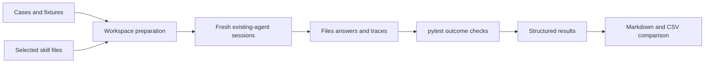

# Requirements

### Goal
- Measure whether your behavior skills improve results or cause the agent to stop before completing required work.
- Start with your existing agent rather than building an agent runner.
- Use open tools: `pytest`, `uv`, and Python’s standard library.
- Produce a repeatable local comparison, not a general claim about AI alignment.

### Smallest useful pilot
- Define six fixed tasks with explicit success criteria.
- Run each task once with the tested skills disabled.
- Run each task once with those skills enabled.
- Total: **12 fresh sessions**.
- Alternate execution order between variants across cases.
- Use three repeats per task only when the pilot warrants further investigation.
    - The expanded suite would contain 36 sessions.
- Automated checking reduces grading effort; executing the sessions remains manual.

### Starter cases
| Case | Required outcome | Failure it exposes |
|---|---|---|
| Bug fix | Fix a small fixture bug and run its requested regression test | Diagnosis-only answers or omitted verification |
| Two-part feature | Implement both explicitly requested transformations | Dropping a requirement as unnecessary complexity |
| Documentation rewrite | Preserve all setup prerequisites while improving readability | Necessary information lost to concision |
| Advice only | Address each question without changing fixture files | Unauthorized implementation |
| Small direct edit | Make exactly the requested correction | Unnecessary changes or investigation |
| TabDriver guidance | Cover all requested integration constraints and known API hazards | Incomplete library-specific advice |

- Use small, self-contained fixtures; no network services or browser installation are required.
- Prefer replacing a starter case with a real task where you observed premature stopping.
- Keep expected answers and grader rules outside the agent’s task workspace.
- Freeze acceptance criteria before comparing outputs.

### Comparison boundaries
- Default tested set follows `skills.sh`: `plexy-do-less`, `plexy-robot`, `plexy-kiss`, `plexy-markdown`.
- Make that list explicit in the manifest so it can match the exact suspected combination.
- Keep `com-olexyn-tabdriver` equally available in both variants for its case.
- Hold the model, agent mode, tools, permissions, fixture contents, and budget constant.
- Use fresh workspaces and fresh conversations for every run.
- Do not edit the existing skills during baseline collection.

### Deliverables
- Six runnable task cases with acceptance checks.
- Workspace preparation and evidence-recording commands.
- A deterministic grading command.
- A Markdown comparison report and machine-readable CSV.
- A short runbook covering the complete workflow.

### Exclusions
- No custom Junie or other agent execution adapter.
- No hosted dashboard, database, CI integration, or model-based judge.
- No browser automation benchmark or Java toolchain requirement.
- No automatic skill rewriting.
- No claim of statistical significance from the pilot.

# Technical Design

### Existing project
- `README.md` describes a collection of independently installable skills.
- `README.md:49–65` documents project-local and global installation.
    - Global installations are a potential source of baseline contamination.
- `skills.sh:23–28` installs four behavior skills plus `skill-creator` into `.agents/skills`.
    - It is an installation script, not an evaluation harness.
    - Do not run it inside baseline workspaces; it would enable the tested skills.
- `.gitignore` currently excludes `/.idea/` and `/.agents/`.
- No existing evaluation harness or Python test configuration was found.
- The attached `com-olexyn-tabdriver/SKILL.md` supplies the library-specific reference facts.

### Architecture


- Adopt the selected artifact-first architecture.
- `pytest` evaluates observable results rather than the agent’s completion claim.
- A small `bench.py` coordinates fixtures, artifact validation, and report generation.
    - It does not launch or replace the agent.
- Use `uv` to resolve and lock the benchmark’s small Python dependency set.
- Keep benchmark code and dependencies separate from skill installation.

### Proposed files
```text
benchmarks/skills/
  README.md
  pyproject.toml
  uv.lock
  manifest.json
  bench.py
  checks/
    test_outcomes.py
  cases/
    bug-fix/
    two-part-feature/
    documentation-rewrite/
    advice-only/
    direct-edit/
    tabdriver-guidance/
  runs/                         # generated; ignored
```

- Each case contains a prompt, fixture files, and structured requirement definitions.
- `manifest.json` records the selected skills, case IDs, variant definitions, and grading version.
- `checks/test_outcomes.py` contains independent acceptance checks.
- Add only `/benchmarks/skills/runs/` to the root `.gitignore`.
- Add a short benchmark link to the root `README.md`.
- Leave `skills.sh` and all existing `SKILL.md` files unchanged.

### Isolation and skill exposure
- Prepare paired workspaces from the same fixture snapshot.
- Record SHA-256 hashes for fixture inputs and the skill files actually supplied.
- Use matching copies of non-tested skills in both variants.
- Disable tested skills through the actual agent’s supported controls.
    - Check both project-local and global exposure.
    - Do not invent agent-specific configuration keys or command-line flags.
- Record available-skill exposure separately from observed skill loading.
    - Evidence states are `confirmed`, `not_loaded`, and `unknown`.
    - Record the trace location supporting a confirmed load.
- The main comparison measures enabled versus disabled availability.
    - It does not assume that every enabled skill was invoked.
- Treat a contaminated baseline as an invalid pair.
- If isolation cannot be established, report the limitation rather than an on/off conclusion.

### Run contract
- Each run stores its workspace, final answer, metadata, and available execution evidence.
- Keep transcripts local; do not commit potentially sensitive session data.
- Represent missing evidence as unknown, not as agent failure or success.

```json
{
  "batch_id": "pilot-001",
  "case_id": "bug-fix",
  "variant": "enabled",
  "repeat": 1,
  "agent": "recorded agent name",
  "model": "recorded model identifier",
  "agent_mode": "implementation",
  "stop_reason": "completed",
  "exposure_verified": true,
  "skill_loading": "unknown",
  "trace_path": "trace.txt"
}
```

- Also record fixture hashes, skill hashes, timestamps, budgets, and permission settings.
- Record tokens and elapsed time only when the agent exposes them reliably.
- Supported stop classifications include completion, voluntary stop, budget exhaustion, and blocked execution.

### Grading
- Every requirement receives `pass`, `fail`, or `unknown`, with an evidence reference.
- Separate these checks:
    - Functional output checks against hidden acceptance inputs.
    - Requested-action checks, such as evidence that the agent ran a test.
    - Scope checks against allowed file changes.
    - Unsupported success claims against available evidence.
- Running a verifier after the session proves the final fixture works.
    - It does **not** prove the agent performed a requested test run.
- Test action evidence requires a recorded command and its result.
    - The final answer saying “tests pass” is insufficient.
- Documentation checks preserve required facts without enforcing exact wording.
- Use a short blind review checklist for facts that cannot be checked reliably by assertions.
    - Reviewers see anonymous variants where practical.
    - Leave unresolved judgments as unknown.
- TabDriver checks cover facts explicitly requested in that case.
    - Java 25+ compatibility for version 1.5.1.
    - Configurable paths through `DefaultTabDriverConfig`.
    - One shared holder and synchronized compound browser operations.
    - Native element interaction instead of the broken script-backed helpers.
    - Shutdown through `getOpt()` without creating a new browser.
- This case grades advice correctness and completeness, not executable browser integration.

### Report
- Show case-level results before aggregate metrics.
- Primary metric: fully completed tasks.
    - All mandatory requirements must pass.
    - Unknown requirements prevent a confirmed complete result.
- Show requirement coverage separately from full completion.
- Show scope violations and unsupported success claims separately.
- Flag unfinished runs as possible premature stops only when evidence rules out genuine blockers.
    - Keep budget, permission, and infrastructure failures in separate categories.
- Report paired completion changes as percentage-point differences.
- Show valid-pair counts, unknown judgments, and exclusion reasons.
- Report style and efficiency only as secondary observations.
- Never combine these dimensions into a weighted score.

### Proposed commands
- Commands below describe the new interface; they do not exist yet.
```bash
uv run --project benchmarks/skills python benchmarks/skills/bench.py prepare --batch pilot-001
uv run --project benchmarks/skills python benchmarks/skills/bench.py grade --batch pilot-001
uv run --project benchmarks/skills python benchmarks/skills/bench.py report --batch pilot-001
```
- `prepare` creates paired workspaces and a run queue with prompts.
- You execute the queue in fresh sessions using your current agent.
- Save the final answer and available trace into the corresponding run directory.
- `grade` validates evidence and invokes the acceptance checks.
- `report` writes `report.md` and `results.csv` within the batch directory.

### Decision rule
- Any confirmed completion regression in the pilot triggers failure inspection.
- Better style or fewer tokens never cancels a completion regression.
- With only six tasks, a small difference remains inconclusive.
- Expand repeats before deciding whether to keep or change a skill.
- If a regression persists, reuse the same cases for leave-one-skill-out comparisons.
    - Ablation variants are optional; do not run every combination initially.

# Validation

### Harness checks
- Exercise the grader with synthetic completed and incomplete runs before collecting agent results.
- Confirm a partially implemented two-part feature fails full completion.
- Confirm correct final code without agent test evidence leaves the requested-action check unverified.
- Confirm advice-only file changes produce a scope violation.
- Confirm an intentionally short, correct direct-edit answer can pass.
- Confirm incomplete documentation fails despite good formatting.
- Confirm incomplete evidence remains unknown rather than being treated as success.
- Confirm blocked runs are not labeled voluntary premature stops.
- Confirm invalid or missing pairs are reported explicitly.
- Confirm unrelated skill-file changes do not affect a frozen batch’s recorded inputs.

### Pilot procedure
- Freeze case prompts and acceptance criteria before execution.
- Verify isolation on one pair before launching the remaining sessions.
- Keep the same agent implementation mode in both variants.
    - A planning-only agent cannot validly complete an implementation case.
- Execute the twelve-run queue with alternating variant order.
- Grade from saved files, outputs, and action evidence.
- Blind-review only the small set of subjective checks.
- Read the report’s failure details before interpreting aggregate numbers.

### Success criteria
- The user can complete the workflow without writing an agent integration.
- The report distinguishes completion from style and scope compliance.
- Every graded requirement points to evidence or is explicitly unknown.
- Runs with different fixture hashes cannot silently form a valid comparison pair.
- Results remain reproducible from stored artifacts without rerunning the agent.
- No existing skill content changes during benchmark implementation.

### Follow-up
- Preserve the pilot as a diagnostic suite.
- Add real regression cases as they occur.
- For promising skill revisions, increase to three repeats per task.
- Keep several later cases outside the tuning set.
- If the suite grows, migrate orchestration to `Inspect AI` without replacing the real agent under evaluation.

# Delivery Steps

###   Step 1: Create the fixed cases and paired-workspace workflow
Six benchmark cases can be prepared as isolated baseline/enabled session pairs.
- Add `benchmarks/skills/manifest.json` with case IDs and the explicit tested skill set.
- Add six prompts, fixture snapshots, and predeclared requirement definitions under `cases/`.
- Include a library-specific advice case grounded in `com-olexyn-tabdriver/SKILL.md`.
- Implement `bench.py prepare` with input hashes and alternating run order.
- Preserve matching non-tested skill exposure across both variants.
- Write the baseline-isolation procedure without assuming undocumented agent settings.
- Check that prepared paired fixtures are identical before any agent edits.

###   Step 2: Implement outcome grading and evidence classification
Saved run artifacts produce requirement-level pass, fail, or unknown results.
- Add the isolated Python package configuration with a locked `pytest` dependency.
- Implement metadata and artifact validation in `bench.py grade`.
- Add functional and allowed-change checks in `checks/test_outcomes.py`.
- Separate final-state correctness from evidence of actions requested of the agent.
- Add a short blind-review checklist for semantic judgments that need human confirmation.
- Classify genuine blockers separately from possible voluntary premature stops.
- Exercise the checks with synthetic complete, incomplete, contaminated, and evidence-missing runs.

###   Step 3: Generate the paired completion-regression report
Each batch produces a readable comparison report and structured results CSV.
- Implement `bench.py report` using standard-library CSV and Markdown generation.
- Display valid-pair counts and requirement-level outcomes for each case.
- Calculate completion and coverage differences without blending them with style scores.
- Include scope violations, unsupported claims, and possible premature stops as separate dimensions.
- Include reliable time or token data when available.
- Show unknown judgments, excluded pairs, and pilot-size limitations prominently.
- Check report calculations against synthetic paired outcomes, including a known completion regression.

###   Step 4: Make the twelve-session pilot easy to operate
A concise runbook takes the user from prepared cases to an interpretable report.
- Write `benchmarks/skills/README.md` with the three proposed benchmark commands.
- Explain how to open fresh sessions and save each answer, trace, and metadata record.
- Document an isolation check on the first pair before completing the run queue.
- Explain the distinction between available skills and confirmed skill loading.
- Provide the predefined regression decision rule and optional leave-one-skill-out procedure.
- Add a benchmark link to the root `README.md`.
- Ignore generated run artifacts in `.gitignore` while keeping fixtures and graders versioned.
- Walk through the full workflow with synthetic artifacts; do not consume twelve live sessions automatically.
